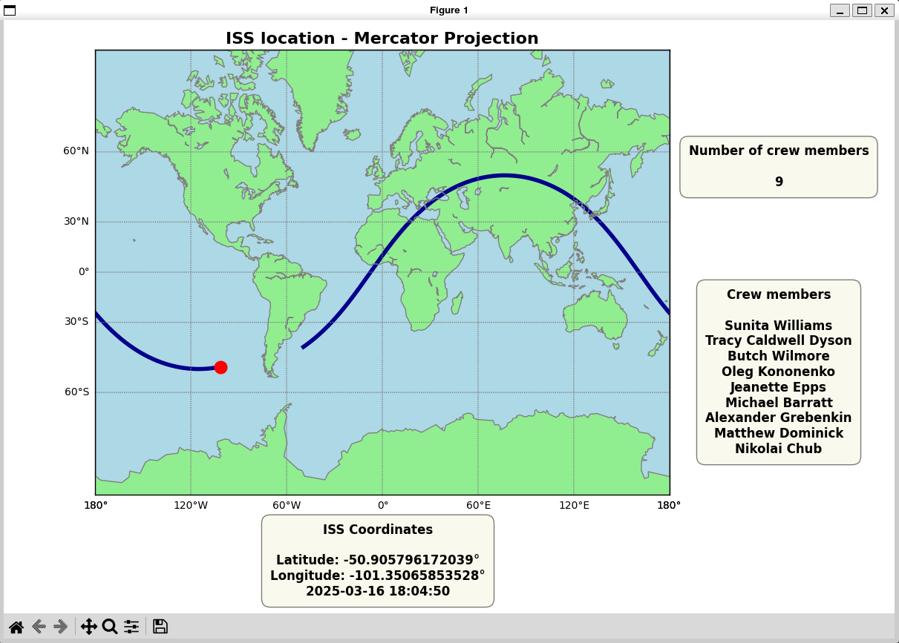

# ISS Orbit View
## Table of Contents
- [Introduction](#introduction)
- [Installation and Usage](#installation-and-usage)
- [API Data Fetching and Validation](#api-data-fetching-and-validation)
- [ISS Location and Trajectory Visualization](#iss-location-and-trajectory-visualization)
- [Future developments](#future-developments)

## Introduction
A project for tracking and visualizing the International Space Station (ISS) in real-time. It retrieves the ISS's position from an API, validates the data, and displays both its current location and trajectory on a map.


## Installation and Usage
1. **Install Dependencies**  
   First, install the required packages by running the following command:
   ```bash
   pip install -r requirements.txt
   ```
2. **Running the Code**  
   Once the dependencies are installed, start the application by running the `main.py` file:
   ```bash
   python main.py
   ```
   No further setup is required.


## API Data Fetching and Validation
This project utilizes two different APIs to extract data related to the International Space Station (ISS):

- [Open Notify API](http://open-notify.org/)  
  This API provides real-time data on the ISS's current latitude and longitude, as well as information about the astronauts currently aboard the station.

- [Where the ISS At? API](https://wheretheiss.at/)  
  This API offers live data about the ISS, including:
  - Latitude and longitude coordinates
  - Timestamp of the location data
  - Velocity
  - Altitude

Both APIs are capable of providing the ISS's position, but the second API was chosen for this task because it also provides additional data that may be useful for future developments.

Position data is retrieved from the API every 5 seconds to prevent overloading the API with requests and to ensure that significant changes in position are captured.

### Data Validation and Error Handling
The responses from both APIs are validated using [Pydantic](https://pydantic-docs.helpmanual.io/), ensuring the data conforms to the expected structure before processing. This step guarantees data integrity and correctness, preventing issues before the data is used within the application.

In particular, if any validation errors occur during data extraction, a `ValidationError` is raised, halting execution to prevent the usage of invalid data.


## ISS Location and Trajectory Visualization  
The ISS location and its trajectory are displayed on a world map, updating in real-time based on data retrieved from the APIs. The map uses the Mercator projection and includes the following features:  
- **Current ISS Position**: A red dot representing the real-time location of the ISS.  
- **ISS Trajectory**: A continuous line showing the path of the ISS as it moves.  
- **ISS Coordinates**: The current latitude, longitude, and timestamp of the ISS.  
- **Crew Information**: The names and number of crew members aboard the ISS.  


### How It Works
1. **Initialization**  
The `draw_earth` function initializes the map using `matplotlib` and the `Basemap` toolkit. It plots the starting position of the ISS on the map based on the provided latitude and longitude, displaying the ISS as a red dot.
2. **Dynamic Updates**  
The `update_iss_location` and `update_iss_trajectory` functions update the ISS position and trajectory on the map as new coordinates are received.   
   - `update_iss_location`: Updates the ISS position marker on the map with the latest coordinates and refreshes the displayed text showing the ISS location, including latitude, longitude, and timestamp.  
   - `update_iss_trajectory`: Updates the trajectory by drawing a continuous path on the map, linking the successive ISS positions over time.
3. **Trajectory management**  
The `trajectory_handler.py` module manages the ISS trajectory by handling coordinate updates and ensuring smooth visualization. It performs two main tasks:  
   - **Handling Map Jumps**: When the ISS crosses from one side of the map to another (e.g., from the far east to the far west), the module detects this jump and inserts a placeholder (NaN) in the trajectory to avoid incorrect visualization of the line on the map.  
   - **Limiting Trajectory Length**: To prevent memory issues and maintain map readability, the trajectory is capped at a maximum length, ensuring that only the most recent points are stored and displayed. Currently, the trajectory is limited to 1000 points.


The following plot displays the outcome of running the application for over an hour.  
Note: The ISS completes one orbit approximately every 90 minutes.




## Future Developments
1. **Improved On-Screen Information**  
   The application could display more detailed information, such as the area or region the ISS is currently overflying, or the speed and altitude of the ISS.
2. **Database Solutions**  
   Future versions could integrate local or cloud-based databases like **CloudSQL** or **BigQuery** to store and manage ISS position data, ensuring scalability and efficient handling of larger datasets.
3. **Machine Learning for Position Prediction**  
   A machine learning model could be trained using historical data to predict the ISS's future position. This would allow the display of both past and predicted trajectories.
